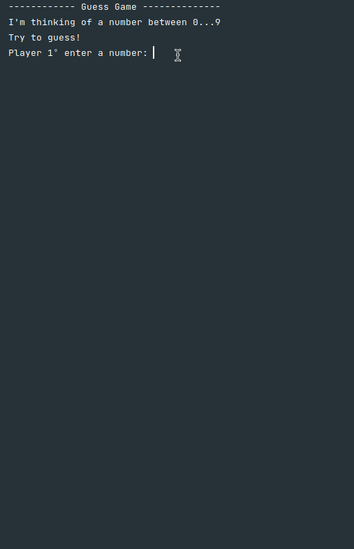

 # Guess Game Python Version

***

Game console made in Python with Pycharm IDE. 
* This project was made in Pycharm IDE 
* This project relies on internal components to function.

### **Intention**
***
The purpose of this project was to practice class, objects, conditionals and while loop in Python.
___
___
### Explanation of the Game
The game is intended to read 3 guesses from 3º players who tried to guess what number the CPU is thinking of.
The program shows the guesses of the players, so if a player hit the number that the CPU is thinking of, it shows a summary of who hit and who missed.
But if no player hit the number, a message is shown and the game restarts.

---
### Summary of the Code
This algorithm was made with 3 <b>Classes</b>, being one of them the class that will start the game, let's call this class <b>"game launcher"</b>.

* **Class Player**
Variables:
    - number = a Integer that takes the number that each player palpitated.
* **Class **
Variables:
    - Date date = a date for the contract
    - double valuePerHour = for the value earned per hour of the worker.
    - Integer hours = for the amount of hours worked by the employee.
* **Class GuessGame**
    Variables:
    - p1 = player.Player => reference variable for player 1.
    - p2 = player.Player => reference variable for player 2.
    - p3 = player.Player => reference variable for player 3.
    - targetNumber = variable to receive a random number that will be the number the CPU is thinking of.
    - p1is_right = receives a boolean to confirm whether the player is correct or not.
    - p2is_right = receives a boolean to confirm whether the player is correct or not.
    - p3is_right = receives a boolean to confirm whether the player is correct or not.
    - p1guess = receive a input in int form for the player
    - p2guess = receive a input in int form for the player
    - p3guess = receive a input in int form for the player
* **Class Game_launcher**
    - game = GuessGame.start_game() = reference variable of the GuessGame type calling the start_game() method of the class.

#### Imports
###### In GuessGame
    - import player;
    - import random;
###### In game_launcher
    - import GuessGame

### Method's

Explanation of the methods used in the algorithm.

##### Class GuessGame
~~~python
def start_game():
    p1is_right = False
    p2is_right = False
    p3is_right = False

    p1guess: int
    p2guess: int
    p3guess: int

    while True:

        print("------------ Jogo da Advinhação --------------")
        print("Estou pensando em um número entre 0 e 9 ....")
        print("Tentem adivinhar!")

        p1guess = int(input("Jogador 1º digite um numero: "))
        p2guess = int(input("Jogador 2º digite um numero: "))
        p3guess = int(input("Jogador 2º digite um numero: "))
        p1.number1 = p1guess
        p2.number2 = p2guess
        p3.number3 = p3guess

        if p1.number1 == targetNumber:
            p1is_right = True
        if p2.number2 == targetNumber:
            p2is_right = True
        if p3.number3 == targetNumber:
            p3is_right = True

        if p1is_right or p2is_right or p3is_right:
            print(f" jogador um forneceu o palpite: {p1.number1}")
            print(f" jogador dois forneceu o palpite: {p2.number2}")
            print(f" jogador três forneceu o palpite: {p3.number3}")
            print("Temos um vencedor!")
            print(f"Numero a adivinhar: {targetNumber}")
            print(f"O jogador um acertou? {p1is_right}")
            print(f"O jogador dois acertou? {p2is_right}")
            print(f"O jogador três acertou? {p3is_right}")
            break
        else:
            print("Os jogadores terão que tentar novamente, pois ninguém acertou! \n")

~~~
> This method was made to receive all the logic of the game in addition to receiving the loop in case no layer hit the number continue playing.

# Image of Application

# Instalation

Clone this repository in your local machine with the command:

- git clone https://github.com/bywilliams/guess_game.git

## Author
***
> William Silva -> [site e portfolio pessoal](https://bywilliams.github.io/site/)

**Thank you for following the documentation and explanation of this little algorithm.**